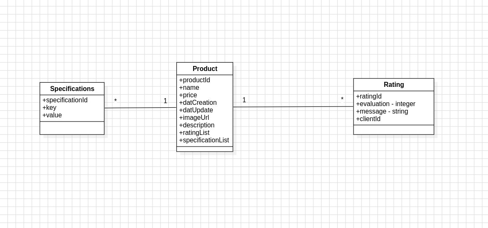

# Documentação de Modelagem de Dados

## 1. Introdução
Este documento apresenta a modelagem de dados do sistema de listagem de produtos, detalhando as entidades principais, seus relacionamentos e os casos de uso fundamentais para o funcionamento do projeto.

## 2. Diagrama de Classes

### Entidades

#### Product
- **productId**: Identificador único do produto.
- **name**: Nome do produto.
- **price**: Preço do produto.
- **datCreation**: Data de criação do produto.
- **datUpdate**: Data da última atualização do produto.
- **imageUrl**: URL da imagem do produto.
- **description**: Descrição detalhada do produto.
- **ratingList**: Lista de avaliações associadas ao produto.
- **specificationList**: Lista de especificações do produto.

#### Specifications
- **specificationId**: Identificador único da especificação.
- **key**: Chave da especificação (ex: cor, tamanho).
- **value**: Valor da especificação (ex: azul, grande).

#### Rating
- **ratingId**: Identificador único da avaliação.
- **evaluation**: Nota atribuída ao produto (inteiro).
- **message**: Comentário do cliente sobre o produto.
- **clientId**: Identificador do cliente que avaliou.

### Relacionamentos
- Um **Product** pode ter várias **Specifications** (1:N).
- Um **Product** pode ter várias **Ratings** (1:N).
- Cada **Specification** e **Rating** está associada a um único **Product**.

## 3. Modelagem de Dados e Persistência

O sistema foi projetado para funcionar tanto com banco de dados relacional quanto com armazenamento local em arquivo JSON, dependendo do ambiente ou necessidade do projeto.

### Banco de Dados
Em uma abordagem tradicional, as entidades Product, Specifications e Rating seriam mapeadas para tabelas em um banco de dados relacional, utilizando chaves primárias e estrangeiras para garantir a integridade referencial:
- **Product**: Tabela principal, armazena os dados do produto.
- **Specifications**: Tabela relacionada, armazena pares chave-valor vinculados ao produto via chave estrangeira.
- **Rating**: Tabela relacionada, armazena avaliações vinculadas ao produto e ao cliente via chave estrangeira.

A modelagem permite consultas eficientes, integridade dos dados e escalabilidade, podendo ser implementada com JPA/Hibernate ou outro ORM.

### LocalStorage
No projeto atual, a persistência dos dados é feita por meio da classe `LocalStorage`, que simula um repositório de produtos utilizando um arquivo JSON como "banco de dados" local. O funcionamento é o seguinte:
- O caminho do arquivo é configurado via propriedade `product.list.file`.
- Ao acessar os métodos do repositório, o arquivo é lido e os dados são desserializados para objetos Java.
- As operações de listagem, busca por ID e ordenação são realizadas em memória.
- O método `getProducts` permite paginação e ordenação por diferentes atributos (nome, preço, avaliação, data de criação).
- O método `getProductById` retorna um produto específico pelo seu identificador.

Essa abordagem é útil para ambientes de desenvolvimento, testes ou aplicações simples, dispensando a necessidade de um banco de dados instalado. Para produção, recomenda-se migrar para um banco de dados relacional ou NoSQL, conforme a necessidade de escalabilidade e segurança.

---
